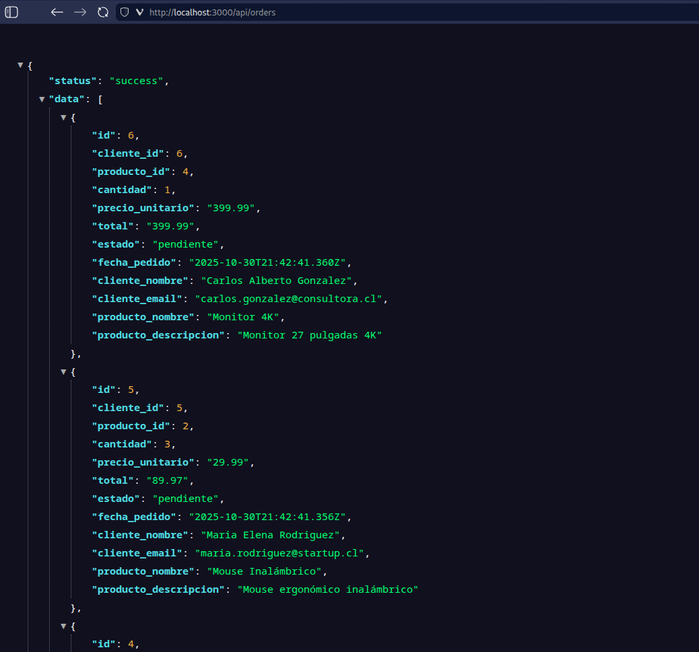
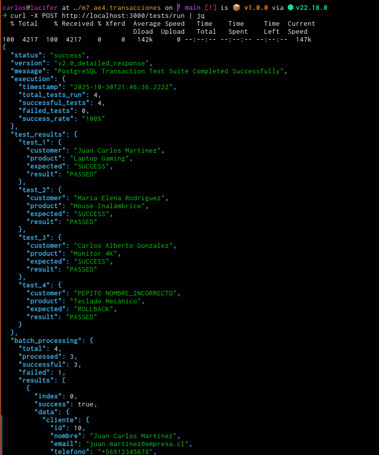

# M7 AE4 - Practicando transacciones SQL en Node con `pg`

# Contexto

El propósito de esta actividad es que el alumno aplique el control de transacciones en PostgreSQL desde un programa en Node.js usando el paquete `pg`, entendiendo cómo y cuándo usar `BEGIN`, `COMMIT` y `ROLLBACK`, así como los principios de integridad, atomicidad y manejo de errores.

## Instrucciones

1. Crea un programa en Node.js que realice operaciones transaccionales sobre una base de datos PostgreSQL.
2. Debes implementar un flujo que simule una situación real donde múltiples operaciones se ejecutan como parte de una misma transacción.
3. Controla y captura errores, incluyendo errores intencionales para probar el ROLLBACK.

## Supuesto del ejercicio

Supón que estás trabajando con una base de datos de ~~banco~~ o tienda. Vas a realizar una transacción compuesta que incluya:

- Crear un nuevo cliente.
- Registrar un nuevo pedido para ese cliente.
- Actualizar el inventario restando las unidades pedidas.

## Requisitos

- Conexión mediante `pool.connect()` y uso del `client` para ejecutar transacciones.
- Uso explícito de las instrucciones: `BEGIN`, `COMMIT`, `ROLLBACK`.
- Simular un error intermedio (ej. clave inexistente en inventario) para probar el `ROLLBACK`.
- Mostrar en consola si la transacción se completó o fue revertida.
- Capturar errores y mostrar mensajes específicos.
- Asegurarse de liberar el `client` en todos los casos (`finally`).

## Notas

- He implementado varios endpoints que no se piden, pero han servido para aprender buenas prácticas, algunas de grado industrial. Por ejemplo:
    - `/tests/run` puedes ejecutar tests para probar las transacciones sin tener que ingresar data manualmente.
    - `/test/cleanse` que sirve para limpiar la data de los test. En este caso, puedes agregar la query `?mode=full` si quieres limpiar toda la data y resetear las secuencias.
    - `/health` es de juguete pero importante para acostumbrarse a crear buenas apis.
- Otra costumbre, es que los endpoints que modifican recursos (no el estado del server necesariamente) están detrás de una sub ruta `/api` que permite dejar limpio el dominio raíz para implementar frontend o similares.
- Por último, el "cómo":
    1. Clona el proyecto.
    2. Crea una bd `transacciones_db` en PostgreSQL
    3. Haz `cd ruta_del_proyecto`
    4. `npm i`
    5. Modifica el `.env.example`: [copia y] renombra a `.env` y además coloca tus credenciales.
    6. Lanza el server con `npm start`
    7. En otra terminal corre `curl -X http://localhost:3000/tests/run` para ejecutar los tests.
    8. Checkea las diferencias en tu DB o en el browser o donde quieras.
    9. Consejo: utiliza `jq` si usas la terminal para una salida más linda con `curl`, o bien utiliza Postman, Insomnia, Bruno, Juanito o lo que quieras si quieres un cliente separado. También puedes correr los endpoints GET directo en el browser. Como la salida es `JSON` si tienes un visor json se verá *cute*. Dos capturas:




## API Endpoints

La aplicación expone los siguientes endpoints REST para interactuar con el sistema de transacciones:

### **Documentación y Estado**
- `GET /` - Documentación de la API y endpoints disponibles
- `GET /health` - Estado del sistema y conectividad de la base de datos

### **Gestión de Pedidos**
- `POST /api/orders` - Crear pedido (producto único o múltiples productos)
- `GET /api/orders` - Listar todos los pedidos procesados

### **Consultas de Inventario**
- `GET /api/inventory` - Mostrar inventario actual con stock disponible
- `GET /api/customers` - Listar todos los clientes registrados

### **Suite de Pruebas**
- `POST /tests/run` - Ejecutar suite completa de pruebas (3 exitosas + 1 rollback)

### **Ejemplo de Uso**

```bash
# Iniciar servidor
npm start

# Crear un pedido con un solo producto
curl -X POST http://localhost:3000/api/orders \
  -H "Content-Type: application/json" \
  -d '{
    "cliente": {
      "nombre": "Juan Pérez",
      "email": "juan@email.com"
    },
    "producto": "Laptop Gaming",
    "cantidad": 1
  }'

# Crear pedido con múltiples productos
curl -X POST http://localhost:3000/api/orders \
  -H "Content-Type: application/json" \
  -d '{
    "cliente": {
      "nombre": "María González",
      "email": "maria@email.com",
      "telefono": "+56987654321",
      "direccion": "Av. Las Condes 456, Santiago"
    },
    "productos": [
      {
        "producto": "Mouse Inalámbrico",
        "cantidad": 2
      },
      {
        "producto": "Teclado Mecánico",
        "cantidad": 1
      },
      {
        "producto": "Monitor 4K",
        "cantidad": 1
      }
    ]
  }'

# Crear pedido con cliente existente (validación email/nombre)
curl -X POST http://localhost:3000/api/orders \
  -H "Content-Type: application/json" \
  -d '{
    "cliente": {
      "nombre": "María González",
      "email": "maria@email.com"
    },
    "producto": "Laptop Gaming",
    "cantidad": 1
  }'

# Verificar inventario actual
curl http://localhost:3000/api/inventory

# Listar todos los clientes
curl http://localhost:3000/api/customers

# Ver pedidos procesados
curl http://localhost:3000/api/orders

# Ejecutar suite completa de pruebas (3 exitosas + 1 rollback)
curl -X POST http://localhost:3000/tests/run
```

**Características principales:**
- Control de transacciones ACID (BEGIN/COMMIT/ROLLBACK)
- Soporte para pedidos de producto único o múltiples productos
- Validación inteligente de clientes (email + nombre matching)
- Validación de stock y disponibilidad de productos
- Manejo robusto de errores con rollback automático
- Salida de consola estilo ASCII clásico

**Lógica de validación de clientes:**
- Si el email es nuevo: se crea un cliente nuevo
- Si el email existe con el mismo nombre: se reutiliza el cliente existente
- Si el email existe con diferente nombre: se rechaza con error